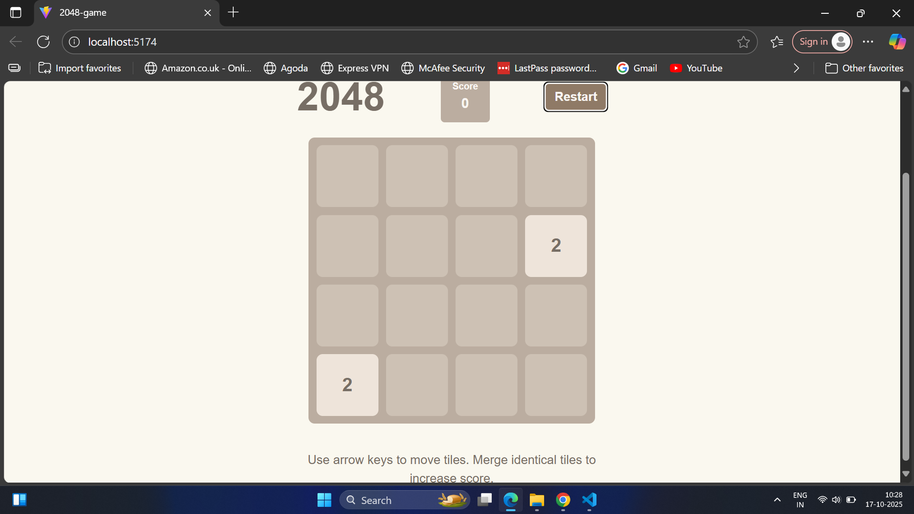

# 🎮 2048 Game – React.js Implementation

A modern recreation of the classic **2048 puzzle game**, built using **React.js**.  
The goal of the game is simple — combine tiles of the same number to reach the **2048 tile!**

---

## 🚀 Overview

This project demonstrates **core frontend engineering skills**, including:
- Component-based UI design with **React**
- **State management** using hooks (`useState`, `useEffect`)
- **Keyboard event handling** for smooth gameplay
- Dynamic **tile merging** and random tile generation logic
- Clean **responsive design** using CSS / Tailwind

---

## 🧩 Features

- 🎯 Merge tiles to reach 2048  
- ⌨️ Play using arrow keys (Up, Down, Left, Right)  
- 🔁 Restart button to reset the game  
- 📱 Responsive layout for desktop and mobile  
- 🧮 Real-time score updates  
- 🧠 Modular code structure for easy extension  

---

## 🧱 Recommended Technology Stack

| Layer | Technology | Why use it |
|--------|-------------|------------|
| **UI / Frontend** | React.js | Component-based, efficient rendering, easy state updates |
| **Styling** | CSS / Tailwind CSS | Simplifies styling and makes tiles colorful, adaptive, and responsive |
| **State Management** | React Hooks (`useState`, `useReducer`) | Handles board, score, and game state cleanly |
| **Random Tile Logic** | Plain JavaScript functions | Pure functions make logic easy to test and maintain |
| **Keyboard Handling** | React `onKeyDown` events | Enables smooth control using arrow keys |
| **Deployment** | GitHub Pages / Netlify / Vercel | Free, easy hosting for live playable demo |

---


---

## ⚙️ Installation and Setup

1. **Clone the repository**
   ```bash
   git clone https://github.com/<your-username>/2048-react-game.git
   cd 2048-react-game
2. **Install dependencies**
```
npm install
```

## Run the development server
```
npm run dev
```

Open the link shown in the terminal (usually http://localhost:5173).

## 🧩 How to Play

Use your arrow keys to move the tiles.

When two tiles with the same number collide, they merge into one.

Each move adds a new random tile (2 or 4) on the board.

The game ends when no moves are possible.

Try to reach 2048!

## 🎨 Screenshots



